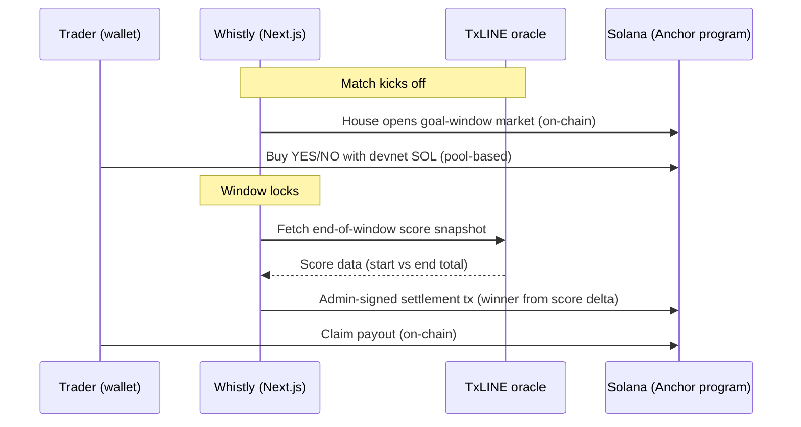

<div align="center">

<picture>
  <source media="(prefers-color-scheme: dark)" srcset="app/public/brand-logo.png">
  
</picture>

# Whistly — Live World Cup Prediction Markets on Solana

**Trade the next moment.** YES/NO micro-markets — *"Goal in the next 5 minutes?"* — that settle on-chain from **TxLINE score data, never majority vote.**

[](https://github.com/rajanpanth/Whistly/actions/workflows/ci.yml)
[](https://explorer.solana.com/address/J9AqrLZWDXaQfDwtFpC2GG9hBb7SAPxRwVpGs753EgWV?cluster=devnet)
[](https://www.anchor-lang.com/)
[](https://nextjs.org/)
[](LICENSE)

**[🌐 Live site](https://www.whistly.tech)** · **[🐦 Launch tweet](https://x.com/Rajan_panth/status/2076665226385383547)**

*Built for the TxODDS World Cup Hackathon — real-time match data wired into real products. $50K across three tracks: **Markets**, **Trading Agents**, and **Fan Experiences**, all powered by TxODDS' live football API on Solana. Whistly competes in Markets & Fan Experiences.*

</div>

---

> [!NOTE]
> **Whistly ran live through the 2026 World Cup** with real TxLINE fixtures — Spain beat Argentina 1–0 in the Jul 20 final to lift the trophy. The homepage now shows the full knockout stage — quarter-finals, semi-finals, third place, and the final — settled from real final scores, never majority vote.
>
> **The tournament — and TxODDS' free World Cup API tier — have now ended**, so live fixture data is no longer served. The settled markets above were resolved while the feed was live; for an interactive walkthrough use the labeled mock mode below.
>
> **Devnet SOL only — no real money.** When TxLINE credentials are not configured, the app **fails closed** (settlement disabled) rather than faking data.

---

## Table of contents

- [What it is](#what-it-is)
- [How it works](#how-it-works)
- [TxLINE integration](#txline-integration)
- [Settlement](#settlement)
- [Features](#features)
- [Routes](#routes)
- [Tech stack](#tech-stack)
- [Quick start](#quick-start)
- [Project structure](#project-structure)
- [Honest limitations](#honest-limitations)

---

## What it is

**Whistly** turns live World Cup moments into short-window prediction markets on Solana. Instead of betting on a whole match, you trade the *next moment*:

- **Goal in the next 5m / 15m / 45m?**
- Both teams to score, over/under totals, goal gap, match result

Each market is a real on-chain position. You stake **devnet SOL** on **YES** or **NO**, the market locks before the window ends, and it resolves from **real TxLINE score data** — then winners claim their share of the pool on-chain. Every settlement and claim is a verifiable transaction on [Solana Explorer](https://explorer.solana.com/?cluster=devnet).

Three design decisions define the project:

| Decision | Why |
|---|---|
| **Oracle settlement, never votes** | Goal-window outcomes are a pure function of start/end score from TxLINE — no juries, no majority-vote games. |
| **House-only market creation** | Markets open automatically at kickoff, operated by the house wallet. No user-created markets means no spam and no ambiguous questions. |
| **Fail-closed data policy** | No TxLINE credentials → settlement disabled and clearly shown. Mock data exists only behind an explicit flag and is labeled everywhere it appears. |

## How it works



## TxLINE integration

Whistly talks to the real TxLINE API (`txline-dev.txodds.com`) using the documented auth model — every data request carries `Authorization: Bearer <guestJwt>` + `X-Api-Token: <apiToken>`.

### Endpoints used

| TxLINE endpoint | Purpose |
|---|---|
| `POST /auth/guest/start` | Auto-fetch a guest session JWT (public, no signup) |
| `GET /api/fixtures/snapshot` | Upcoming & live World Cup fixtures |
| `GET /api/scores/snapshot/{fixtureId}` | Score data used for settlement |
| `POST /api/token/activate` | Free-tier activation (wallet-signed) → data API token |

### One-click free-tier activation

> **Note:** the free World Cup tier ended with the tournament — the flow below worked throughout the event and is kept for reference / paid-tier reuse.

TxLINE's free World Cup tier requires a one-time on-chain subscription. Whistly builds and sends it **from the user's wallet** at [`/txline-setup`](https://www.whistly.tech/txline-setup):

1. Fetch a guest JWT (public endpoint).
2. Wallet signs an on-chain `subscribe(level 1, 4 weeks)` to the txoracle program (`6pW64gN1s2uqjHkn1unFeEjAwJkPGHoppGvS715wyP2J`) — no TxL payment, only devnet fees.
3. Wallet signs the activation message `${txSig}::${jwt}`.
4. Server exchanges it at `/api/token/activate` for the data API token — held server-side, never exposed to the browser.

After activation, real fixtures drive the homepage and scores drive settlement.

### Fail-closed status system

`GET /api/txline/status` reports the honest state, and the whole UI keys off it:

| State | Meaning | Effect |
|---|---|---|
| `connected` | Real TxLINE data flowing | Settlement enabled |
| `not_configured` | No API token | **Settlement disabled**, "TxLINE Not Configured" shown |
| `error` | TxLINE request failed | **Settlement disabled**, "TxLINE Error" shown |
| `mock` | `NEXT_PUBLIC_ENABLE_MOCK_MODE=true` | Labeled "Mock Mode — not real TxLINE data" |

## Settlement

Goal-window markets resolve deterministically from score data:

```txt
startTotal = startHomeScore + startAwayScore   (recorded when the market opens)
endTotal   = endHomeScore   + endAwayScore     (fetched from TxLINE at window end)

YES wins  if  endTotal > startTotal
NO  wins  otherwise
```

Example: `1-1 → 2-1` resolves **YES**; `1-1 → 1-1` resolves **NO**.

**Market lifecycle:** `OPEN → LOCKED → RESOLVING → RESOLVED → CLAIMABLE`

Settlement will **not** run if: TxLINE is unconfigured, the fixture or score is missing, the window hasn't ended, the market is already resolved, or the admin wallet isn't connected.

**Admin flow (wallet-signed).** The `/admin` panel lets the house: view TxLINE status, list live markets with `fixtureId` and start score, fetch the end score as a dry run, review the proposed winner and its data source, then **sign the settlement transaction**. Nothing is recorded as settled until the on-chain transaction confirms.

**Invariants:** `marketKind` — `0 = Standard`, `1 = LiveGoalWindow` · outcome index — `0 = NO`, `1 = YES`.

## Features

- **Full on-chain loop** — open market (house), buy YES/NO, oracle-driven settle, claim — via an Anchor program with pool-based liquidity (no P2P transfers, no order book).
- **Real World Cup data** — actual fixtures and kickoff times from TxLINE, live countdown timers, settled markets showing final scores with Won/Lost outcomes.
- **Live goal-window terminal** (`/live`) — window selector (5m/15m/45m), trade panel, pool book with implied probability, goal-window timeline, and settlement proof with Explorer links.
- **Step-line market charts** — probability history rendered as discrete repricing steps (the honest shape of an order-driven market) with hover crosshair and tooltip.
- **TxLINE data health widget** — live connected / not-configured / error / mock state, visible on `/live`, `/admin`, and `/txline-setup`.
- **Honest UI copy everywhere** — "Devnet", "Settlement disabled until TxLINE is configured", "Markets resolve from score data, not majority vote".
- **Premium dark marketplace UI** — featured hero carousel, category grids, responsive down to 360px.

## Routes

| Route | Purpose |
|---|---|
| `/` | Marketplace home — featured markets, settled quarter-finals, upcoming semis/final with live countdowns |
| `/live` | Live goal-market terminal — windows, trade panel, timeline, settlement proof |
| `/world-cup` | World Cup market discovery + fixture feed |
| `/verify` | Settlement verification & proof notes |
| `/portfolio` | Your positions and claims |
| `/admin` | Wallet-gated house panel — TxLINE settlement flow |
| `/txline-setup` | TxLINE status + one-click free-tier activation |

## Tech stack

| Layer | Technology |
|---|---|
| Blockchain | Solana (Devnet) — program [`J9Aqr…EgWV`](https://explorer.solana.com/address/J9AqrLZWDXaQfDwtFpC2GG9hBb7SAPxRwVpGs753EgWV?cluster=devnet) |
| Smart contract | Anchor 0.30.1 (Rust) |
| Data layer | TxLINE / TxODDS oracle |
| Frontend | Next.js 15, React 19, TypeScript |
| Styling | Tailwind CSS + custom design system |
| Wallet | `@solana/wallet-adapter` (Phantom, etc.) |
| RPC | Helius (devnet) via `NEXT_PUBLIC_SOLANA_RPC_URL` |
| Off-chain | Supabase (comments, metadata) — optional |
| CI | GitHub Actions — Anchor build, cargo audit, Jest (98 tests), lint + typecheck |

## Quick start

### Prerequisites

- Node.js ≥ 18
- A Solana wallet (Phantom) set to **Devnet**, with some devnet SOL (`solana airdrop 2`)

### Run

```bash
git clone https://github.com/rajanpanth/Whistly.git
cd Whistly/app
npm install
npm run dev
```

Open [http://localhost:3000](http://localhost:3000).

### Environment variables

Create `app/.env.local`:

```env
# ── TxLINE (real data) ────────────────────────────────────────────
TXLINE_BASE_URL=https://txline-dev.txodds.com   # optional, this is the default
TXLINE_GUEST_JWT=                               # optional — auto-fetched
TXLINE_API_TOKEN=                               # required for real data — see below

# ── Mock mode (labeled demo fallback, never implicit) ─────────────
NEXT_PUBLIC_ENABLE_MOCK_MODE=false

# ── Solana ────────────────────────────────────────────────────────
NEXT_PUBLIC_SOLANA_RPC_URL=                     # dedicated devnet RPC (Helius etc.) — public endpoint rate-limits hard
NEXT_PUBLIC_ADMIN_WALLETS=                      # comma-separated house/admin wallet(s)

# ── Auth ──────────────────────────────────────────────────────────
AUTH_JWT_SECRET=                                # random secret for wallet sign-in JWTs
```

**To get real data:** open `/txline-setup` with a devnet-funded wallet and click **Activate with wallet** — the issued token is logged server-side so you can persist it as `TXLINE_API_TOKEN`. Alternatively run the official TxODDS `subscription_free_tier.ts` script and paste the token. *(The free World Cup tier ended with the tournament, so activation no longer returns live data.)*

**For a labeled demo without credentials:** set `NEXT_PUBLIC_ENABLE_MOCK_MODE=true` — all mock data is clearly labeled in the UI, and `/live` gains demo scenario controls (simulate goal / no goal) that exercise the same on-chain settlement path.

## Project structure

```
Whistly/
├── programs/instinctfi/          # Anchor program (Rust) — markets, positions, settlement, claims
├── tests/                        # Anchor tests
├── .github/workflows/            # CI — anchor build, cargo audit, jest, lint, typecheck
└── app/                          # Next.js 15 frontend
    └── src/
        ├── app/
        │   ├── live/             # Live goal-market terminal
        │   ├── admin/            # House panel + TxLINE settlement flow
        │   ├── txline-setup/     # Free-tier activation flow
        │   └── api/
        │       ├── txline/       # status · fixtures · scores · guest-jwt · activate · demo
        │       ├── markets/      # create-live-goal · resolve-live-goal
        │       └── rpc/          # admin-gated RPC handlers (create/settle house-only)
        ├── components/           # Marketplace UI, charts, widgets
        └── lib/
            └── txline/           # Fail-closed client, response adapters, runtime auth
```

## Honest limitations

- Real fixtures/scores appear **only after** the one-time wallet activation (or a `TXLINE_API_TOKEN` env var) — TxLINE requires an on-chain subscription even for the free tier, so there is no credential-free path to real data.
- The score-payload parser follows the documented TxLINE schema and fails closed if a payload can't be parsed.
- On-chain TxLINE proof validation (`validate_stat_v3`) is **not** implemented, and the UI never claims it.
- Live-market metadata is held in-memory server-side (resets on restart); on-chain poll state is the source of truth for funds.
- Built for the 2026 World Cup — after the tournament, the live fixture feed will naturally show finished matches.

## License

Distributed under the **MIT License**. See [LICENSE](LICENSE) for details.

---

<div align="center">
  <sub>Whistly — trade the next moment. ⚽ Built solo for the TxODDS World Cup Hackathon.</sub>
</div>
